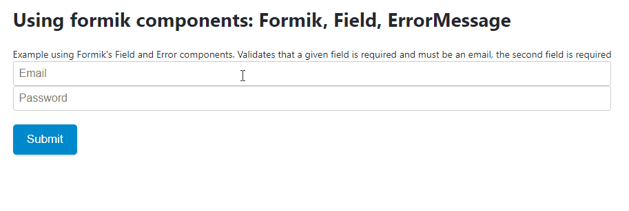
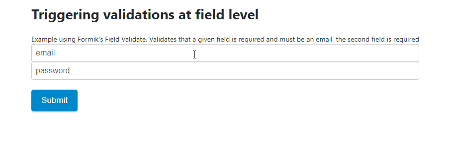
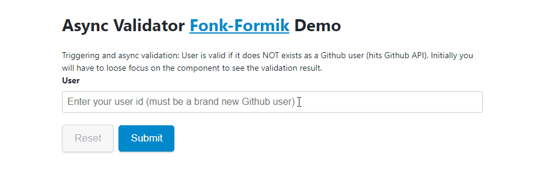
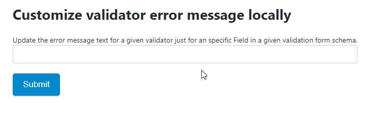
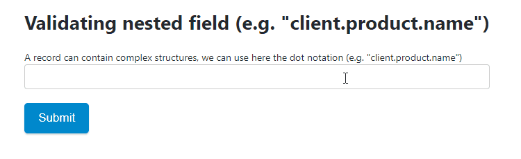

# Integrating Fonk with React Formik

[Formik](https://github.com/jaredpalmer/formik) is a great library to manage forms state.

Adding **Fonk** to **Formik** allows you to seamlessly add validation capabilities to **Formik**.

In order to use **Fonk** with **Formik** you will have to install **fonk-formik** adaptor:

```bash
npm install @lemoncode/fonk @lemoncode/fonk-formik --save
```

The main change to apply when using a **fonk-formik** comes when you want to instantiate
**Fonk** engine with your form validation schema, instead of calling _createFormValidation_
, just replace that entry with _createFormikValidation_

```diff
- import { createFormValidation, Validators } from '@lemoncode/fonk';
+ import { Validators } from '@lemoncode/fonk';
+ import { createFormikValidation } from '@lemoncode/fonk-formik';

const validationSchema = {
  field: {
    email: [Validators.required.validator],
    password: [Validators.required.validator]
  }
};

- export const formValidation = createFormValidation(validationSchema);
+ export const formValidation = createFormikValidation(validationSchema);
```

Now you can hook to Formik form validation (example):

```diff
    <Formik
      initialValues={{ email: "", password: "" }}
+     validate={formValidation.validateForm}
      onSubmit={(values, { setSubmitting }) => {
        setTimeout(() => {
          alert(JSON.stringify(values, null, 2));
          setSubmitting(false);
        }, 400);
      }}
    >
```

And if you want to hook to Formik field validations (example):

```diff
  <form onSubmit={handleSubmit}>
    <Field
      name="email"
+     validate={(value) => formValidation.validateField("email", value)} />
```

Example: How to display field validation error message:

```diff
    <Field name="email"/>
+    {errors &&
+      errors.email &&
+       touched.email &&
+       <div>{errors.email}</div>}
```

# Examples:

[Basic example](https://codesandbox.io/s/github/lemoncode/fonk/tree/master/examples/formik/js/basic)


[Using formik Field](https://codesandbox.io/s/github/lemoncode/fonk/tree/master/examples/formik/js/formik-components)



[Firing validations at field level](https://codesandbox.io/s/github/lemoncode/fonk/tree/master/examples/formik/js/field-level-validation)



[Asynchronous validation](https://codesandbox.io/s/github/lemoncode/fonk/tree/master/examples/formik/js/async-validator)



[Customizing validator's error messages globaly](https://codesandbox.io/s/github/lemoncode/fonk/tree/master/examples/formik/js/custom-error-message-global)


[Customizing validator's error messages just for a given form](https://codesandbox.io/s/github/lemoncode/fonk/tree/master/examples/formik/js/custom-error-message-local)



[Creating custom validators](https://codesandbox.io/s/github/lemoncode/fonk/tree/master/examples/formik/js/custom-validators)


[Validating nested fields](https://codesandbox.io/s/github/lemoncode/fonk/tree/master/examples/formik/js/nested-field)



[Defining record validations](https://codesandbox.io/s/github/lemoncode/fonk/tree/master/examples/formik/js/record-validation)


