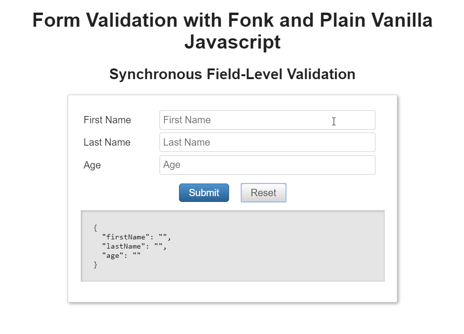

# Getting Started

## Installation

Getting started with [**Fonk**](https://github.com/Lemoncode/fonk) is something really easy and quick. First of all you will need to install **Fonk** in your existing project using your favorite package manager (we'll assume npm for this example).

```bash
npm install @lemoncode/fonk --save
```

> **Fonk** is Typescript friendly, typing definitions are already included in the main package.

## Using

Fonk is framework agnostic, it just works out of the box (no dependencies).

We are going to start by adding some lines of code to define a login validation record:

```javascript
const loginRecord = {
  user: '',
  password: '',
};
```

Now we are going to define the following validation schema for this form:

- **User field** is a required field.

- **Password** field is a required field.

Let's get started with Fonk, it is time to create the validation schema:

```javascript
import { Validators, createFormValidation } from '@lemoncode/fonk';

const validationSchema = {
  field: {
    user: [Validators.required.validator],
    password: [Validators.required.validator],
  },
};

const formValidation = createFormValidation(validationSchema);
```

And let's fire a field validation (usually we will fire this in the *onChange* or *onBlur* event of every HTML field):

```javascript
formValidation
  .validateField('user', loginRecord.user)
  .then(validationResult => {
    console.log(validationResult);
  });
```

Since the record field user is empty, we will get the following output from the _console.log(validationResult)_:

```bash
{
  succeeded: false,
  message: "Please fill in this mandatory field.",
  type: "REQUIRED"
}
```

What happens if we feed the login.user field with data?

```javascript
loginRecord.user = 'John';
```

And we fire again the field validation:

```javascript
formValidation
  .validateField('user', loginRecord.user)
  .then(validationResult => {
    console.log(validationResult);
  });
```

We get the following result (validation succeeded):

```bash
{
  succeeded: true,
  message: "",
  type: "REQUIRED"
}
```

If you want to fire all the form validations in one go, you can execute *validateForm*

```javascript
formValidation.validateForm(loginRecord).then(validationResult => {
  console.log(validationResult);
});
```

And you will get the result of firing all defined validations in the schema (in this case _user_ has been
already informed and _password_ field is empty):

```bash
{
  succeeded: false,
  fieldErrors: {
    user: {
      succeeded: true,
      message: "",
      type: "REQUIRED"
    },
    password: {
      succeeded: false,
      message: "Please fill in this mandatory field.",
      type: "REQUIRED"
    },
  },
  recordErrors: {}
}
```

## UI Examples



You can play with this example in the following sandbox [validate-field js](https://codesandbox.io/s/github/lemoncode/fonk/tree/master/examples/vanilla/js/validate-field) and [validate-form js](https://codesandbox.io/s/github/lemoncode/fonk/tree/master/examples/vanilla/js/validate-form).

Typescript version: [validate-field ts](https://codesandbox.io/s/github/lemoncode/fonk/tree/master/examples/vanilla/ts/validate-field) and [validate-form ts](https://codesandbox.io/s/github/lemoncode/fonk/tree/master/examples/vanilla/ts/validate-form)

If you want to check a full example including user interface interaction, check the following sandboxes:

- Plain vanilla js example: https://codesandbox.io/s/github/lemoncode/fonk/tree/master/examples/vanilla/js/validate-field

- React + React Final Form: https://codesandbox.io/s/github/lemoncode/fonk/tree/master/examples/react-final-form/js/validate-field

- React + Formik: https://codesandbox.io/s/github/lemoncode/fonk/tree/master/examples/formik/js/basic

## Next steps

Now many questions will be arising in your head:

- Can I define more than one field validation per field?
- Where can I find more validations already implemented? (we call this _validators_).
- How can I create my custom _validator_?
- What about asynchronous validations?
- And global form validations?(we call them record level validations).
- Does it integrate well with libraries like React Final Form?
- What about multilanguage support?

All this cases are covered by the library, let's jump into the next topic
[Validation Schema](/validation-schema)
