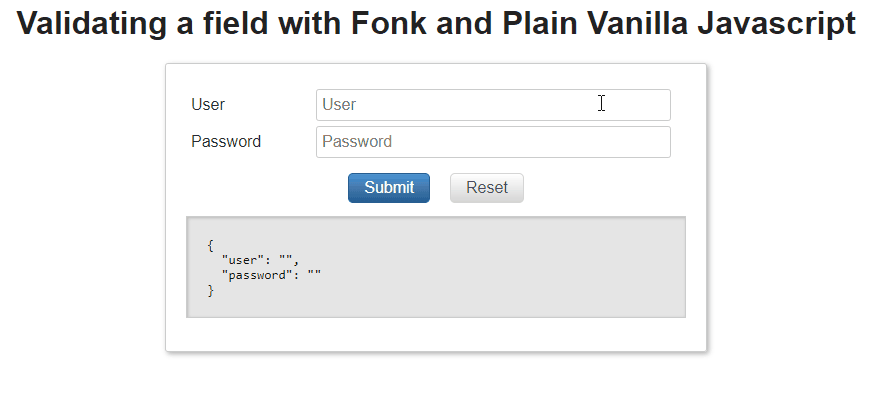

# Field Validation

Once we have our ValidationSchema defined and we have instantiated the [**FormValidation**](/api#formvalidation), it exposes
a method called [**validateField**](/api#validatefield), this method allows us to validate a given field, the signature of this
method:

```typescript
  public validateField(fieldId: string, value: any,values?: any): Promise<ValidationResult>
```

In this method we pass as arguments:

- The name of the field we want to validate.
- The current value of the field (usually we get this value for instance from a *OnChange* *OnBlur* input event args).
- Optionally we can feed the whole record values (in some cases you need to feed the current form values, 
e.g. there is a *requiredOnField* value where a given field is required depending on another record field value).

And it returns:

- A promise (validateField is async) including the validation result, it can be succeeded if all validations associated to that field passed, or fail in case any of the associated validations
  fail (in that case you get back an error message and a validation type).

The validations associated to a field are executed sequentially, starting from the one defined at index 0, the validation process stops as soon as one of the associated
field validations fail.

> You can find detailed information about this method in the [api definition](/api#validatefield).

Let's get our hands wet:

We want to validate a login form, we have the following model:

```javascript
const loginValues = {
  user: '',
  password: '1234',
};
```

Let's define the following [**Validation Schema**](/api#validationschema):

```javascript
import { Validators, createFormValidation } from '@lemoncode/fonk';

const validationSchema = {
  field: {
    user: [
      Validators.required,
      {
        validator: Validators.minLength,
        customArgs: { length: 3 },
      },
    ],
  },
};

const formValidation = createFormValidation(validationSchema);
```

Let's call **validateField** passing the *user* field and the empty string value:

```javascript
const loginValues = {
  user: '',
  password: '1234',
};

formValidation
  .validateField('user', loginValues.user)
  .then(validationResult => {
    console.log(validationResult);
  });
```

The result that we get back:

```javascript
{
  "succeeded": false,
  "message": "Please fill in this mandatory field.",
  "type": "REQUIRED"
}
```

That is: The validation failed, the field is required

Now let's try to validate this field passing as value the string 'a'

```javascript
const loginValues = {
  user: 'a',
  password: '1234',
};

formValidation
  .validateField('user', loginValues.user)
  .then(validationResult => {
    console.log(validationResult);
  });
```

The result that we get back:

```javascript
{
  "succeeded": false,
  "message": "The value provided does not fulfill min length",
  "type": "MIN_LENGTH"
}
```

In this case *required* validation passed but *minLength* validation didn't pass.

Finally, let' try to validate this field pass as value the string 'abc'.

```javascript
const loginValues = {
  user: 'abc',
  password: '1234',
};

formValidation
  .validateField('user', loginValues.user)
  .then(validationResult => {
    console.log(validationResult);
  });
```

The result that we get back:

```javascript
{
  "succeeded": true,
  "message": "",
  "type": "MIN_LENGTH"
}
```

In this case all field associated passed and we get as result validation succeeded.



Examples:

- [Plain Vanilla JS](https://codesandbox.io/s/github/lemoncode/fonk/tree/master/examples/docs/general/js/validating-field).
- [Plain Vanilla TS](https://codesandbox.io/s/github/lemoncode/fonk/tree/master/examples/docs/general/ts/validating-field).

Now that you know how to validate a field let's jump into adding [record validations](/validating-record)
