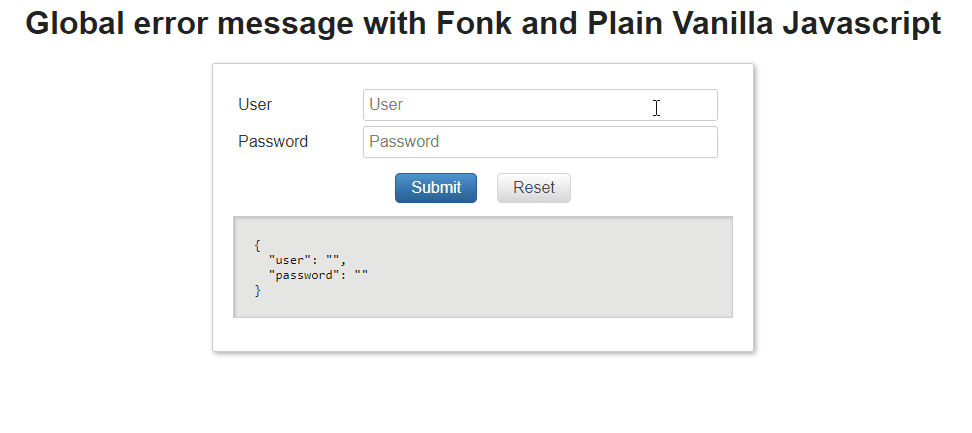

# Customizing error messages

When a given validation fails, a Fonk validator returns a default error message, this messages can be overriden
in two ways:

- You can customize the error message(s) returned by a single validator in a global way (any validation
  schema using this validator will just use this new error message).

- You can customize the error message for a single field or record validation in a given validation schema.

> Additionally _Validators_ return the TYPE of validator executed (TYPE is a unique identifier) and whether it succeed or not.

In which scenarios you will choose whether to globally or locally?

- Globally customizing a validator error message can be quite useful to provide multilanguage support, e.g.: a
  given user changes the language from English to Spanish, then you want RequiredFieldValidator error message
  to be updated from "This Field is required" to "Debe informar el campo", this should be applied to all
  validationSchemas field entries that are using this validator.

- Setting up a field level validation can be useful for wide validators like _Pattern_ validators: this validator
  validates the entered text against a regular expression, let's say you use this validator to validate an
  IBAN number, and in another field you just validate a BIC number, you don't want to display a generic
  'Pattern is not valid' message, you want to display a message like "Invalid IBAN number" and "Invalid BIC number"
  for each of the fields.

# Global error message customization

We will take as example _required validator_, at the entry point of our application we need to add the following
code:

```javascript
import { Validators, createFormValidation } from '@lemoncode/fonk';

const validationSchema = {
  field: {
    // The default error message is:
    // "Please fill in this mandatory field."
    user: [Validators.required],
  },
};

const formValidation = createFormValidation(validationSchema);
```

- Update error message using globally way:

```diff
import { Validators, createFormValidation } from '@lemoncode/fonk';

+ // Spanish message
+ Validators.required.setErrorMessage("Debe informar el campo");

const validationSchema = {
  field: {
    // The default error message is:
    // "Please fill in this mandatory field."
    user: [Validators.required],
  },
};

const formValidation = createFormValidation(validationSchema);
```



- [Plain Vanilla JS](https://codesandbox.io/s/github/lemoncode/fonk/tree/master/examples/docs/messages/js/vanilla/global-error-message).
- [Plain Vanilla TS](https://codesandbox.io/s/github/lemoncode/fonk/tree/master/examples/docs/messages/ts/vanilla/global-error-message).
- [React + React Final Form JS](https://codesandbox.io/s/github/lemoncode/fonk/tree/master/examples/docs/messages/js/react-final-form/global-error-message).
- [React + React Final Form TS](https://codesandbox.io/s/github/lemoncode/fonk/tree/master/examples/docs/messages/ts/react-final-form/global-error-message).

# ValidationSchema field validation customization

We will take as example _pattern validator_, we will setup a validation schema and customize the error
message for the _IBAN_ field and the _BIC_ field

```javascript
import { Validators, createFormValidation } from '@lemoncode/fonk';

const validationSchema = {
  field: {
    ibanAccount: [
      {
        validator: Validators.pattern,
        customArgs: { pattern: /^ES\d*$/ },
      },
    ],
    bicAccount: [
      {
        validator: Validators.pattern,
        customArgs: { pattern: /^BIC\d*$/ },
      },
    ],
  },
};

const formValidation = createFormValidation(validationSchema);
```

- Update error message using locally way:

```diff
import { Validators, createFormValidation } from '@lemoncode/fonk';

const validationSchema = {
  field: {
    ibanAccount: [
      {
        validator: Validators.pattern,
        customArgs: { pattern: /^ES\d*$/ },
+       message: 'Invalid IBAN number',
      },
    ],
    bicAccount: [
      {
        validator: Validators.pattern,
        customArgs: { pattern: /^BIC\d*$/ },
+       message: 'Invalid BIC number',
      },
    ],
  },
};

const formValidation = createFormValidation(validationSchema);
```


- [Plain Vanilla JS](https://codesandbox.io/s/github/lemoncode/fonk/tree/master/examples/docs/messages/js/vanilla/local-error-message).
- [Plain Vanilla TS](https://codesandbox.io/s/github/lemoncode/fonk/tree/master/examples/docs/messages/ts/vanilla/local-error-message).
- [React + React Final Form JS](https://codesandbox.io/s/github/lemoncode/fonk/tree/master/examples/docs/messages/js/react-final-form/local-error-message).
- [React + React Final Form TS](https://codesandbox.io/s/github/lemoncode/fonk/tree/master/examples/docs/messages/ts/react-final-form/local-error-message).

# Building a custom validator that support error messages customization.

Check the sections [Custom Validators](/validators/custom-validators-sync), to find how to customize error message.

Check the [api](/api), for more information
