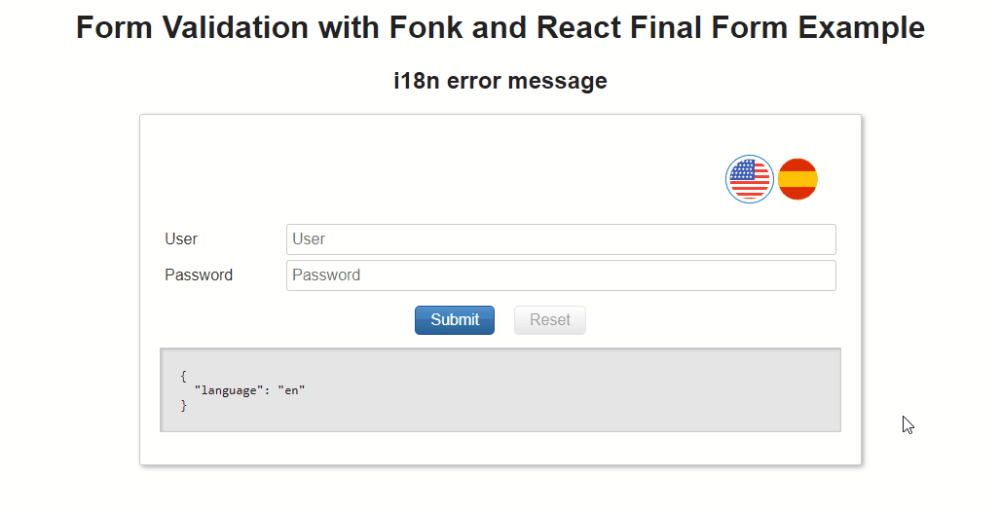
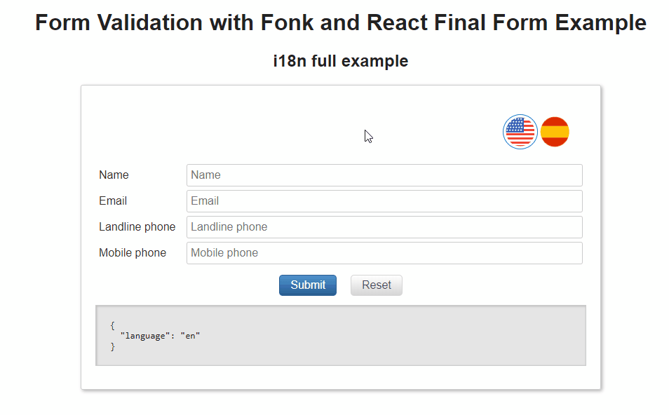

# Internationalization

Check the section [customize error message](/messages/error-message) to learn the basics about how to customize your error messages.

There are serveral libraries to work with i18n, we will use [i18next](https://github.com/i18next/i18next) which we can define translations as:

```javascript
// translations.js
export const translations = {
  en: {
    required: 'Required field',
    email: 'Not valid email address',
  },
  es: {
    required: 'Debe informar el campo',
    email: 'La dirección de email no es válida',
  },
};
```

Create the `i18n` instance:

```javascript
import i18next from 'i18next';
import { translations } from './translations';

export const createI18n = language => {
  const i18n = i18next.createInstance();

  i18n.init({
    lng: language,
    fallbackLng: language,
    resources: {
      en: {
        translation: {
          ...translations.en,
        },
      },
      es: {
        translation: {
          ...translations.es,
        },
      },
    },
  });

  return i18n;
};
```

The `i18n` instance provides the `t` method for translate your app by defined `keys` (e.g: `required` and `email` previously defined in translations):

```javascript
const i18n = createI18n('en');

i18n.t('required'); // Required field

i18n.changeLanguage('es');

i18n.t('required'); // Debe informar el campo
```

> NOTE: This is pseudocode due to `changeLanguage` returns a Promise.

If we are using `React`, we will need to use the `I18nextProvider` from `react-i18next` and even we can create a `LanguageContext` where we will provide the `current language` and a method to change the language. That is, something like:

```javascript
import React from 'react';

export const LanguageContext = React.createContext(null);
```

Create `LanguageProvider`

```diff
import React from 'react';
+ import { I18nextProvider } from 'react-i18next';

export const LanguageContext = React.createContext(null);

+ export const LanguageProvider = props => {
+   const { children } = props;

+   return (
+     <I18nextProvider i18n={}>
+       <LanguageContext.Provider value={}>
+         {children}
+       </LanguageContext.Provider>
+     </I18nextProvider>
+   );
+ };
```

Create language state and i18n instance:

```diff
import React from 'react';
import { I18nextProvider } from 'react-i18next';
+ import { createI18n } from './i18n';

export const LanguageContext = React.createContext(null);

export const LanguageProvider = props => {
  const { children } = props;
+ const [language, setLanguage] = React.useState('en');
+ const i18n = React.useMemo(() => createI18n(language), []);

  return (
-   <I18nextProvider i18n={}>
+   <I18nextProvider i18n={i18n}>
-     <LanguageContext.Provider value={}>
+     <LanguageContext.Provider value={{ language }}>
        {children}
      </LanguageContext.Provider>
    </I18nextProvider>
  );
};
```

Use `i18n.changeLanguage` when language changes:

```diff
import React from 'react';
import { I18nextProvider } from 'react-i18next';
  import { createI18n } from './i18n';

export const LanguageContext = React.createContext(null);

export const LanguageProvider = props => {
  const { children } = props;
  const [language, setLanguage] = React.useState('en');
  const i18n = React.useMemo(() => createI18n(language), []);

+ const handleSetLanguage = newLanguage => {
+   i18n.changeLanguage(newLanguage);
+   setLanguage(newLanguage);
+ };

  return (
    <I18nextProvider i18n={i18n}>
      <LanguageContext.Provider
        value={{
          language,
+         setLanguage: handleSetLanguage,
        }}
      >
        {children}
      </LanguageContext.Provider>
    </I18nextProvider>
  );
};
```

## Global error message translation

As we learned in previous section, we can customize error message globally using the `setErrorMessage` method provided by validators. We only need to provide the translated message when language changes:

```javascript
import { Validators } from '@lemoncode/fonk';
import { createI18n } from './i18n';

const i18n = createI18n('en');

Validators.required.setErrorMessage(i18n.t('required'));
Validators.email.setErrorMessage(i18n.t('email'));
```

If we are using `React`, we can use `useTranslation` hook and access to the `t` method:

```javascript
import { Validators } from '@lemoncode/fonk';
import { useTranslation } from 'react-i18next';


const App = () => {
  const { t } = useTranslation();
  Validators.required.setErrorMessage(t('required'));
  Validators.email.setErrorMessage(t('email'));
  ...
}
```


Check these `i18next React Final Form` examples:

- [React React Final Form JS](https://codesandbox.io/s/github/lemoncode/fonk/tree/master/examples/docs/messages/js/react-final-form/i18n-global-message).
- [React React Final Form TS](https://codesandbox.io/s/github/lemoncode/fonk/tree/master/examples/docs/messages/ts/react-final-form/i18n-global-message).

## Custom Validation Schema error messages translation

This time, we will use `message` property available in `validationSchema`. Each time language selection is changed, we need to update value assigned to the message property in order to assign the new literal, we need to refresh the Form Validation instance:

```javascript
// form-validation.js

import { Validators, createFormValidation } from '@lemoncode/fonk';

const validationSchema = {
  field: {
    user: [
      {
        validator: Validators.required.validator,
      },
    ],
  },
};

export const formValidation = createFormValidation(validationSchema);
```

Provide the `t` method:

```diff
import { Validators, createFormValidation } from '@lemoncode/fonk';

+ export const createValidation = t => {
    const validationSchema = {
      field: {
        user: [
          {
            validator: Validators.required.validator,
+           message: t('required'),
          },
        ],
      },
    };

-   export const formValidation = createFormValidation(validationSchema);
+   return createFormValidation(validationSchema);
+ }

```

If we are using `React`, we can create a custom hook to create a new form validation instance when language changes:

```javascript
// use-validation.js
import React from 'react';
import { useTranslation } from 'react-i18next';
import { LanguageContext } from './i18n';
import { createValidation } from './form-validation';

export const useValidation = () => {
  const { language } = React.useContext(LanguageContext);
  const { t } = useTranslation();

  const formValidation = React.useMemo(() => {
    return createValidation(t);
  }, [language]);

  return { formValidation };
};
```



Check these `i18next React Final Form` examples:

- [React React Final Form JS](https://codesandbox.io/s/github/lemoncode/fonk/tree/master/examples/docs/messages/js/react-final-form/i18n-local-message).
- [React React Final Form TS](https://codesandbox.io/s/github/lemoncode/fonk/tree/master/examples/docs/messages/ts/react-final-form/i18n-local-message).

## Full implementation (global + local validation schema messages)

We can mix both approaches:

```javascript
// form-validation.js

import { Validators, createFormValidation } from '@lemoncode/fonk';

const validationSchema = {
  field: {
    name: [Validators.required.validator],
    email: [Validators.required.validator, Validators.email.validator],
  },
};

export const formValidation = createFormValidation(validationSchema);
```

Add local translations:

```diff
import { Validators, createFormValidation } from '@lemoncode/fonk';

+ export const createValidation = t => {
    const validationSchema = {
      field: {
        name: [Validators.required.validator],
        email: [
          Validators.required.validator,
-         Validators.email.validator
+         {
+           validator: Validators.email.validator,
+           message: t('email'),
+         },
        ],
      },
    };

-   export const formValidation = createFormValidation(validationSchema);
+   return createFormValidation(validationSchema);
+ }
```

Add global translations:

```diff
import { Validators, createFormValidation } from '@lemoncode/fonk';

export const createValidation = t => {
+ Validators.required.setErrorMessage(t('required'));

  const validationSchema = {
    field: {
      name: [Validators.required.validator],
      email: [
        Validators.required.validator,
        {
          validator: Validators.email.validator,
          message: t('email'),
        },
      ],
    },
  };

  return createFormValidation(validationSchema);
};

```



Check these `i18next React Final Form` examples:

- [React React Final Form JS](https://codesandbox.io/s/github/lemoncode/fonk/tree/master/examples/docs/messages/js/react-final-form/i18n-full-example).
- [React React Final Form TS](https://codesandbox.io/s/github/lemoncode/fonk/tree/master/examples/docs/messages/ts/react-final-form/i18n-full-example).
