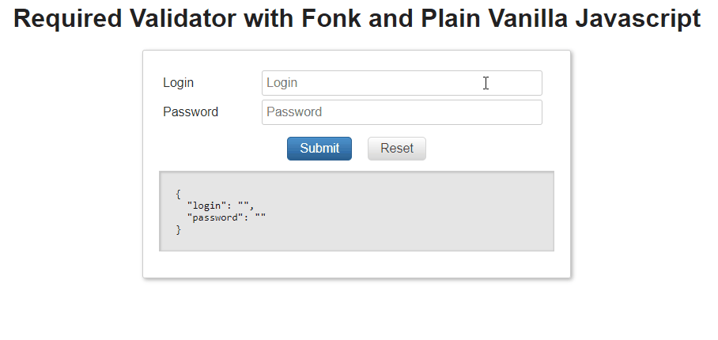
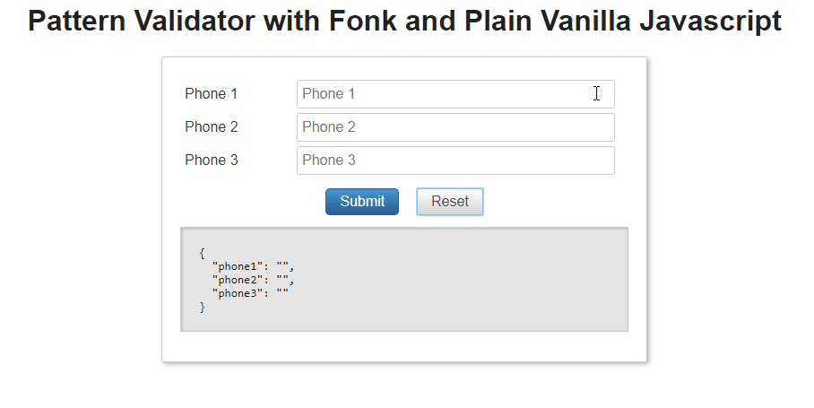
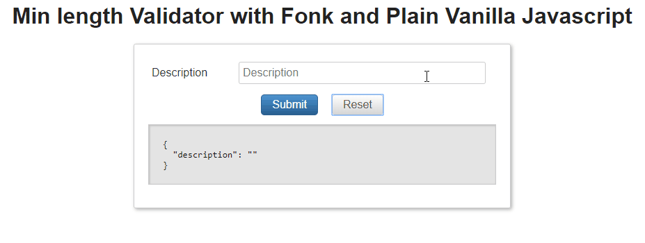
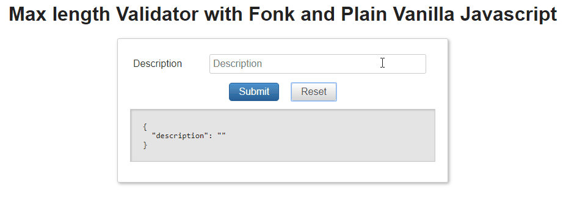

# Built in validators

Fonk already ships a set of basic validators:

- Required: check if a field is informed (field is not null, undefined or empty string), this can be applied to fields of type _string_ or _number_.
- Pattern: check if field matches with a given RegExp.
- MinLength: check if a string field has a minimum length.
- MaxLength: check if a string field has a maximum length.
- Email: check if a string field is a well formed email address.
- Array: adds validation support to form array fields.

> If you want to customize the error messages that this validators provide by default, check the [error-message](/messages/error-message) and [internationalization](/messages/internationalization)

## Required

Check if a field is informed (field is not null, undefined or empty string), this can be applied to fields of type *string* or *number*.

It accepts a custom parameter to instruct the validator to trim the incoming values
(if true a value like ' ' would be treated as an empty string).

```typescript
export interface RequiredArgs {
  trim: boolean; // Default value equals true
}

export const required: FieldValidationFunctionSync<RequiredArgs> = (fieldValidatorArgs) : ValidationResult => {...}
```

Usage:

- Simple, (trim default value equals true):

```typescript
import { Validators, ValidationSchema } from '@lemoncode/fonk';

const validationSchema: ValidationSchema = {
  field: {
    login: [Validators.required],
  },
};
```

- With customArgs

```typescript
import { Validators, ValidationSchema } from '@lemoncode/fonk';

const validationSchema: ValidationSchema = {
  field: {
    login: [Validators.required],
    password: [
      {
        validator: Validators.required,
        customArgs: { trim: false },
      },
    ],
  },
};
```



Example:

You can find this example in [Javascript](https://github.com/Lemoncode/fonk/tree/master/examples/docs/api/js/required) and [Typescript](https://github.com/Lemoncode/fonk/tree/master/examples/docs/api/ts/required).

## Pattern

Succeeds if a field matches with a defined **RegExp**, fails if not. This regular expression can be either a [RegExp](https://developer.mozilla.org/en-US/docs/Web/JavaScript/Reference/Global_Objects/RegExp) instance or a string.

> If the string is empty it won't fail (to cover this case use the _required_ validator).

Is mandatory to pass the RegExp expression to be evaluated.

```typescript
export interface PatternArgs {
  pattern: string | RegExp;
}

export const pattern: FieldValidationFunctionSync<PatternArgs> =
(fieldValidatorArgs): ValidationResult => {...}
```

Usage:

- String:

```typescript
import { Validators, ValidationSchema } from '@lemoncode/fonk';

const validationSchema: ValidationSchema = {
  field: {
    phone: [
      {
        validator: Validators.pattern,
        customArgs: { pattern: '^(7|8|9)\\d{9}$' },
      },
    ],
  },
};
```

- RegExp:

```typescript
import { Validators, ValidationSchema } from '@lemoncode/fonk';

const validationSchema: ValidationSchema = {
  field: {
    phone: [
      {
        validator: Validators.pattern,
        customArgs: { pattern: /^(7|8|9)\d{9}$/ },
      },
    ],
  },
};
```

- RegExp constructor:

```typescript
import { Validators, ValidationSchema } from '@lemoncode/fonk';

const validationSchema: ValidationSchema = {
  field: {
    phone: [
      {
        validator: Validators.pattern,
        customArgs: { pattern: new RegExp(/^(7|8|9)\d{9}$/) },
      },
    ],
  },
};
```



Example:

You can find this example in [Javascript](https://github.com/Lemoncode/fonk/tree/master/examples/docs/api/js/pattern) and [Typescript](https://github.com/Lemoncode/fonk/tree/master/examples/docs/api/ts/pattern).

## MinLength

Succeeds if a field length is greater than the one informed in the customArgs.length

> If the string is empty it won't fail (to cover this case use the *required* validator).

Is mandatory to pass the min length value.

```typescript
export interface LengthArgs {
  length: number;
}

export const minLength: FieldValidationFunctionSync<LengthArgs> = (fieldValidatorArgs) : ValidationResult => {...}
```

Usage:

```typescript
import { Validators, ValidationSchema } from '@lemoncode/fonk';

const validationSchema: ValidationSchema = {
  field: {
    description: [
      {
        validator: Validators.minLength,
        customArgs: { length: 10 }, // Valid description for length greater than 10 chars
      },
    ],
  },
};
```

Custom message with interpolated `customArgs`:

```typescript
import { Validators, ValidationSchema } from '@lemoncode/fonk';

const validationSchema: ValidationSchema = {
  field: {
    description: [
      {
        validator: Validators.minLength,
        customArgs: { length: 10 }, // Valid description for length greater than 10 chars
        message: 'The min length is {{length}}',
      },
    ],
  },
};
```



Example:

You can find this example in [Javascript](https://github.com/Lemoncode/fonk/tree/master/examples/docs/api/js/min-length) and [Typescript](https://github.com/Lemoncode/fonk/tree/master/examples/docs/api/ts/min-length).

## MaxLength

Succeeds if a field length is lower than the one informed in the customArgs.length

> If the string is empty it won't fail (to cover this case use the *required* validator).

Is mandatory to pass the max length value.

```typescript
export interface LengthArgs {
  length: number;
}

export const maxLength: FieldValidationFunctionSync<LengthArgs> = (fieldValidatorArgs) : ValidationResult => {...}
```

Usage:

```typescript
import { Validators, ValidationSchema } from '@lemoncode/fonk';

const validationSchema: ValidationSchema = {
  field: {
    description: [
      {
        validator: Validators.maxLength,
        customArgs: { length: 20 }, // Valid description for length lower than 20 chars
      },
    ],
  },
};
```

Custom message with interpolated `customArgs`:

```typescript
import { Validators, ValidationSchema } from '@lemoncode/fonk';

const validationSchema: ValidationSchema = {
  field: {
    description: [
      {
        validator: Validators.maxLength,
        customArgs: { length: 20 }, // Valid description for length lower than 20 chars
        message: 'The max length is {{length}}',
      },
    ],
  },
};
```



Example:

You can find this example in [Javascript](https://github.com/Lemoncode/fonk/tree/master/examples/docs/api/js/max-length) and [Typescript](https://github.com/Lemoncode/fonk/tree/master/examples/docs/api/ts/max-length).

## Email

Succeeds if a field value is a well formed email, fails if not.

> If the string is empty it won't fail (to cover this case use the *required* validator).

```typescript
export const email: FieldValidationFunctionSync = (fieldValidatorArgs) : ValidationResult => {...}
```

Usage:

```typescript
import { Validators, ValidationSchema } from '@lemoncode/fonk';

const validationSchema: ValidationSchema = {
  field: {
    email: [Validators.email],
  },
};
```


Example:

You can find this example in [Javascript](https://github.com/Lemoncode/fonk/tree/master/examples/docs/api/js/email) and [Typescript](https://github.com/Lemoncode/fonk/tree/master/examples/docs/api/ts/email).

## Array

This validator allows you to add support to validation to array form fields, it work as an inception,
you get the fonk engine embedded into that array, _e.g. you got a shopping cart list and you want
to validate that each Quantity field on each row is informed and is a valid number_.

```typescript
TODO: ADD HERE INTERFACE DEFINITION
```

Usage:

```Javascript
TODO: ADD SIMPLE EXAMPLE
```

Animated GIF how it works

Example

TODO: include both examples

## More validators

**Fonk** only ships with a minimal subset of validators to avoid adding extra weight to the library with other validators that you may not use.

If you are in the need of using / implementing other validators:

- You have an available list of microlibraries that implement a wide set of validators, allowing you to cherry pick the validators that you really need avoding extra weight into your application adding validators that you don't need. You can find a list of third party validators in the following [link](/validators/third-party-validators).

- You can implement your own custom validator, is quite easy, you can find instructions about how to build your own custom validation in these links: [sync custom validators](/validators/custom-validators-sync) and [async custom validators](/validators/custom-validators-async).
