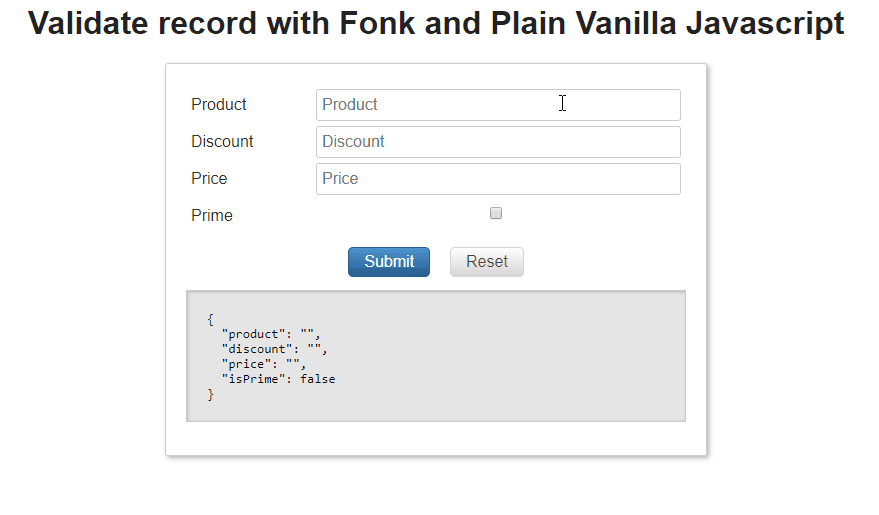

# Custom validators synchronous

Once you have checked that a given field or record validation is not available in the base or
third parties list of validators, it's time to create your own validator.

## Field Validator

A field synchronous validator is just a function that expects one argument (this argument is an object that contains
several fields), and return a validation result.

> What do we mean by synchronous? That is any validation that executes some code and returns a result straightforward,
> if your validation needs to make a request to a server, it cannot provide a straightdforward result and probably
> you will have to manage it using promises, in that case you have to use asynchronous validations, this is covered in the following
> [link](/validators/custom-validators-async).

Usually a Field Validator can be a perfect piece of code to be reused across the application and even to be included
in a common library.

### Disecting a validator

The definition of a synchronous field validator:

- **FieldValidationArgs**: This is passed as a single argument in the validator
  - **value**: current field value.
  - **values**: form / record values (all fields).
  - **customArgs**: we can pass custom arguments to our validator, this allow us to create flexible and configurable
    validators (e.g. in a min-length validator we can pass as customArgument a number indicating the minlength allowed,
    or if we have a password / repeat password validator we can pass the id of the password field to the repeat password
    field).
  - **message**: you can override here the error message that the validator returns in case of failure. You can inject
    in a message _parameter_ to be interpolated by the validator (e.g. 'string must be at least {{minlength}}'),
    in some validators there may be more than one error message defined, in that case we can pass an array of strings.
- **ValidationResult**: once the validator has been executed it returns a _ValidationResult_:
  - If the validation succeeds, you get as return value a _ValidationResult_ where it's _succeeded_ field value is true.
  - If the validation fails, you get as return value a _ValidationResult_ where it's _succeeded_ field value is false,
    and a _message_ where you get a user friendly error message and a _type_ field that indicates the validator that
    failed.

```typescript
export interface FieldValidatorArgs {
  value: any;
  values?: any;
  customArgs?: any;
  message?: string | string[];
}

export interface ValidationResult {
  type: string;
  succeeded: boolean;
  message: string;
}

export type FieldValidationFunctionSync = (
  fieldValidatorArgs: FieldValidatorArgs
) => ValidationResult;
```

### Learning by example

The best way to learn how to implement a validator is just by building one.

Let's get started: we want to validate that an [IBAN](https://en.wikipedia.org/wiki/International_Bank_Account_Number)
(International Bank Account) field belongs to Spain (that is first two characters must be equal to _ES_).

We will start simple, in order to perform the validation we only need use the current field _value_ we
don't need other optional params: _values_, _customArgs_, _message_, we will follow a TDD like approach
we will create the validator always faling (returning a failed validation result).

```javascript
const validatorType = 'MY_IBAN_VALIDATOR';

export const myValidator = fieldValidatorArgs => {
  const validationResult = {
    succeeded: false,
    type: validatorType,
    message: 'IBAN does not belong to Spain',
  };

  return validationResult;
};
```

Let's got for the next step, we got a validator that always fails, now is time to inject our logic; we just want to validate
that the IBAN belongs to spain (first two characters must be _ES_).

```diff
const validatorType = 'MY_IBAN_VALIDATOR';

export const myValidator = fieldValidatorArgs => {
+ const { value } = fieldValidatorArgs;
  const validationResult = {
    succeeded: false,
    type: validatorType,
    message: 'IBAN does not belong to Spain',
  };

+ if (value && value[0] === 'E' && value[1] === 'S') {
+   validationResult.succeeded = true;
+   validationResult.message = '';
+ }

  return validationResult;
}
```

Now we got our simple validator working, if you enter an IBAN that belongs to spain it will pass
the validation if not it will fail.

_Watch out... what if we pass a null/undefined/empty string?_ Validation will succeed in this case, _but is
not a valid IBAN isn't it?_ Usually is a good practice to delegate this validation to a prior validator like
the built-in **required** validator, _why?:_ maybe the field you want to validate is optional hence the
IBAN validator should not fail, by doing that we are following the single responsibility principle.

The validator was fine but what happens if we need to override the validation message? For instance you
need give support to multiple languages (english, spanish, french...), you can override the
message(s) validators in two ways:

- You can setup the validator message(s) globally for any ValidationSchema instance (for instance you
  just change from english to french language and you want that _MyValidator_ shows the error message
  in french in all the application forms where it's being used).

- You can override the validation message just for a given ValidationSchema (for instance if you use
  the built in _pattern_ (regex) validator you may want for an specific field in a validation schema to return
  _invalid credit card_ and for other cases _invalid shield number_).

Let's start by adding implementation into our validator to allow the developer consuming the validator change the error message globally:

```diff
const validatorType = 'MY_IBAN_VALIDATOR';

+ let defaultMessage = 'IBAN does not belong to Spain';
+ export const setErrorMessage = message => (defaultMessage = message);

export const myValidator = fieldValidatorArgs => {
  const { value } = fieldValidatorArgs;

  const validationResult = {
    succeeded: false,
    type: validatorType,
-   message: 'IBAN does not belong to Spain',
+   message: defaultMessage,
  };

  if (value && value[0] === 'E' && value[1] === 'S') {
    validationResult.succeeded = true;
    validationResult.message = '';
  }

  return validationResult;
};
```

Now let's go for the specific override (just only customize the message for a given field on a given
validation schema):

```diff
const validatorType = 'MY_IBAN_VALIDATOR';

let defaultMessage = 'IBAN does not belong to Spain';
export const setErrorMessage = message => (defaultMessage = message);

export const myValidator = fieldValidatorArgs => {
- const { value } = fieldValidatorArgs;
+ const { value, message = defaultMessage } = fieldValidatorArgs;

  const validationResult = {
    succeeded: false,
    type: validatorType,
-   message: defaultMessage,
+   message,
  };

  if (value && value[0] === 'E' && value[1] === 'S') {
    validationResult.succeeded = true;
    validationResult.message = '';
  }

  return validationResult;
};
```

> If you want to learn more about how to customize error message + internationalization you can jump
> to the following [section](/messages/error-message).

_That was awesome, but I need to implement the same validation for country entries like france (FR), germany (DE), and others, is there a way to make this validator more generic?_
Yes, we can make use of _customArgs_ and pass the _country_ prefix to validate (in a real case you could opt in to implement this inside the validator using a switch
statement but the goal of this example is to show you how to deal with _customArgs_).

We can assume the consumer of this validator will pass the country code in the _customArgs_ something like:

```javascript
{
  countryCode: 'ES',
}
```

Let's further enhance the validator (we will add support for that custom arg in our validator):

```diff
const validatorType = 'MY_IBAN_VALIDATOR';

let defaultMessage = 'IBAN does not belong to Spain';
export const setErrorMessage = message => (defaultMessage = message);

+ const hasValidCountryCode = (value, customArgs) =>
+   value &&
+   value[0] === customArgs.countryCode[0] &&
+   value[1] === customArgs.countryCode[1];

export const myValidator = fieldValidatorArgs => {
- const { value, message = defaultMessage } = fieldValidatorArgs;
+ const { value, customArgs, message = defaultMessage } = fieldValidatorArgs;

+ // Depending in your case you may feed default values to customArgs or throw
+ // an exception or a console.log error
+ if (!customArgs.countryCode || customArgs.countryCode.length !== 2) {
+   throw `${validatorType}: error you should inform customArgs countryCode prefix (2 characters length)`;
+ }

  const validationResult = {
    succeeded: false,
    type: validatorType,
    message,
  };

- if (value && value[0] === 'E' && value[1] === 'S') {
+ if (hasValidCountryCode(value, customArgs)) {
    validationResult.succeeded = true;
    validationResult.message = '';
  }

  return validationResult;
};
```

That was great, but there's something going wrong, the validation error message still says:

_'IBAN does not belong to Spain'_

We could just go the easy way and change the validation message to something more generic:

_'IBAN country code not valid'_

But we want to use a more elegant solution, why not building a message like:

_IBAN country code prefix must be {{countryCode}}_

> _countryCode_ is just the name of the customArg we added previously.

Let's implement this:

```diff
+ import { parseMessageWithCustomArgs } from '@lemoncode/fonk';
const validatorType = 'MY_IBAN_VALIDATOR';

- let defaultMessage = 'IBAN does not belong to Spain';
+ let defaultMessage = 'IBAN does not belong to {{countryCode}}';
export const setErrorMessage = message => (defaultMessage = message);
...

  const validationResult = {
    succeeded: false,
    type: validatorType,
-   message,
+   message: parseMessageWithCustomArgs(message, customArgs),
  };

```

_Wow ! That was awesome ! but how can I customize this message if I need internationalization?_ You can
override the message and just use the same interpolation sequence _{{countryCode}}_ where applies.

> Note down: you have to document this in your validator so consumers of your validator are aware of this params.


_So far so good, but what happens if I need another form field value to execute my field validator?_ Let's say for
instance I got a signUp form where the user has to enter his password, then reenter it in a different field
to avoid him introducing any typo by mistake. That's a great use case, let's dig into that:

> This validator is already available as a third party plugin, you can find it in the following [link](https://github.com/Lemoncode/fonk-iban-validator).

We've got the following form:

```javascript
const mySignupFormData = {
  email: 'john.doe@mydomain.com'
  password : '123',
  repeatPassword: '124',
}
```

First we will implement a validator specific for that form, we will access _customArgs.values_ field to get other form field value:

```javascript
const validatorType = 'FIELDS_MATCH_VALIDATOR';

 let defaultMessage = 'Fields does not match';
 export const setErrorMessage = message => (defaultMessage = message);

export const fieldMatchValidator = (fieldValidatorArgs) {
  // All form/record data is passed in the fieldValidatorArgs.values field
  const {value, values, message = defaultMessage} = fieldValidatorArgs
  const validationResult = {
    succeeded: false,
    type: validatorType,
    message,
  };

  // Now we can acces the 'password' field from the values field
  if (value === values.password) {
    validationResult.succeeded = true;
    validationResult.message = '';
  }

  return validationResult;
}
```

_Fine, we managed to build to the validator, but is too tied up to the form, couldn't it be possible to create a reusable validator?_
the answer is yes if we combine togheter _fieldValidationArgs.values_ and _fieldValidationArgs.customArgs_ (in customArgs we will
pass the name of the field to compare with).

- **customArgs**: here we will pass the id of the field to check (in this case the _password_ field).

- **values**: here we get all the form/record values, we can use the following approach to access
  the _password_ field:

Let's see how to combine this both together:

```diff
const validatorType = 'FIELDS_MATCH_VALIDATOR';

 let defaultMessage = 'Fields does not match';
 export const setErrorMessage = message => (defaultMessage = message);

export const fieldMatchValidator = (fieldValidatorArgs) {
  // All form/record data is passed in the fieldValidatorArgs.values field
+ // We will make use of customArgs
-  const {value, values, message = defaultMessage} = fieldValidatorArgs
+   const {value, values, customArgs, message = defaultMessage} = fieldValidatorArgs
  const validationResult = {
    succeeded: false,
    type: validatorType,
    message,
  };

+  // Depending in your case you may feed default values to customArgs or throw
+  // an exception or a console.log error
+  if(!customArgs.fieldToCompareName) {
+    throw(`${validatorType}: you need to inform the fieldToCompareName`)
+  }

-  // Now we can acces the 'password' field from the values field
+  We just grab the value of the field using the bracket accesor
+  more info:
+  https://developer.mozilla.org/en-US/docs/Web/JavaScript/Reference/Operators/Property_Accessors
-  if (value === values.password) {
+  if(value === value[customArgs.fieldToCompareName])
    validationResult.succeeded = true;
    validationResult.message = '';
  }

  return validationResult;
}
```

Check here:

- [Plain Vanilla JS](https://codesandbox.io/s/github/lemoncode/fonk/tree/master/examples/docs/validators/js/vanilla/iban-custom-sync-validator).
- [Plain Vanilla TS](https://codesandbox.io/s/github/lemoncode/fonk/tree/master/examples/docs/validators/ts/vanilla/iban-custom-sync-validator).
- [React + React Final Form JS](https://codesandbox.io/s/github/lemoncode/fonk/tree/master/examples/docs/validators/js/react-final-form/iban-custom-sync-validator).
- [React + React Final Form TS](https://codesandbox.io/s/github/lemoncode/fonk/tree/master/examples/docs/validators/ts/react-final-form/iban-custom-sync-validator).

## Record Validator

A record validator is a validation that is not tied up to an specific field, is usually something that we trigger
when the user hits submit, and before sending the information to the server.

Record validations usually are not highly reusable functions, they are tied up to the domain of the form to be validated.

### Disecting a record validator

The definition of a synchronous field validator:

- **RecordValidationArgs**: This is passed as a single argument in the validator
  - **values**: form / record values (all fields).
  - **message**: you can override here the error message that the validator returns in case of failure. You can inject
    in a message _parameter_ to be interpolated by the validator (e.g. 'string must be at least {{minlength}}'),
    in some validators there may be more than one error message defined, in that case we can pass an array of strings.
- **ValidationResult**: once the validator has been executed it returns a _ValidationResult_:
  - If the validation succeeds, you get as return value a _ValidationResult_ where it's field _succeeded_ is true.
  - If the validation fails, you get as return value a _ValidationResult_ where it's field _succeeded_ is false,
    and a _message_ where you get a user friendly error message and a _type_ field that indicates the validator id that
    generated the error.

```typescript
export interface RecordValidatorArgs {
  values: any;
  message?: string | string[];
}

export interface ValidationResult {
  type: string;
  succeeded: boolean;
  message: string;
}

export type RecordValidationFunctionSync = (
  recordValidatorArgs: RecordValidatorArgs
) => ValidationResult;
```

### Learning by example

We got a form that displays the total monetary amount of a given shopping order:

```javascript
const myFormValues = {
  product: 'shoes',
  discount: 5,
  price: 20,
  isPrime: false,
};
```

Once the user hits on submit order and before sending the request to the server we want to check the following rule: FreeShipping
can be true if the total amount (price - discount) is greater than 20 USD, or if the field _isPrime_ is true.

A validator to implement this:

```javascript
// A record validator receives in the args an object with
// all the record values and optionally the custom message
const freeShippingRecordValidator = ({ values }) => {
  const succeeded = values.isPrime || values.price - values.discount > 20;

  return {
    succeeded,
    message: succeeded
      ? ''
      : 'Subscribe to prime service or total must be greater than 20USD',
    type: 'RECORD_FREE_SHIPPING',
  };
};
```

> If you need to implement internationalization or customize messages you can follow the same approach
> as the described for the field record validations.



Full example implemented:

- [Plain Vanilla JS](https://codesandbox.io/s/github/lemoncode/fonk/tree/master/examples/vanilla/js/validate-record).
- [Plain Vanilla TS](https://codesandbox.io/s/github/lemoncode/fonk/tree/master/examples/vanilla/ts/validate-record).
- [React + React Final Form JS](https://codesandbox.io/s/github/lemoncode/fonk/tree/master/examples/react-final-form/js/validate-record).
- [React + React Final Form TS](https://codesandbox.io/s/github/lemoncode/fonk/tree/master/examples/react-final-form/ts/validate-record).

# Next section

Now that you have learn how to build synchronous custom validators is time to learn how to implement [asynchronous custom validators](/validators/custom-validators-async).
